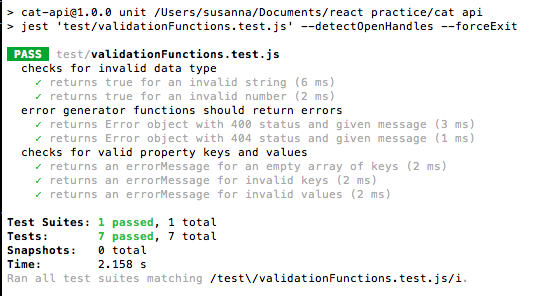
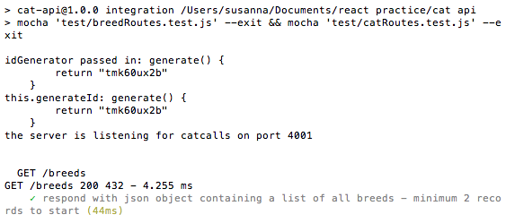

# Cat API #

# A REST API using ExpressJS

A data repository to manage information about cats and pedigree breeds via the HTTP request-response cycle.

## Getting Started 

If npm is not yet installed (run 'npm -v' in Terminal to check), run 'npm install' to install. 
Run 'npm start' on Terminal to start the server. 

See section [How To Use](#how-to-use) to begin sending http requests. 
See section [Tests](#how-to-test) for how to run test suites. 

# Motivation

To create an API with full CRUD functionality to put knowledge of [Javascript](https://www.javascript.com/) and the [ExpressJS](https://expressjs.com/) framework into practice.  
It provided the opportunity to use the [mocha](https://mochajs.org/) framework, [jest](https://jestjs.io/) and [supertest](https://www.npmjs.com/package/supertest) library for writing unit and integration tests. 

It helped me to develop my [github](https://github.com/) workflow for better management of *branches* and *pull requests*, to enable separation of concerns for easier review and working.   

## How To Use 

1.  Enter 'npm start' in Terminal. The tab will now read 'node'

```javascript
the server is listening for catcalls on port 4001
```
2. Open new tab in Terminal. This tab reads 'bash'. 
3. Enter a curl command request, including parameters / request body as required. 
4. Response returns in Terminal. The Terminal name prompt indicates that the request-response cycle is finished. Examples below: 

```javascript

// GET all cats request 
curl --location --request GET 'localhost:4001/cats'

// Response to GET all cats requests - object returned
{
    "cats": [
        {
            "id": "uKVZvMxhLt",
            "breedId": 1,
            "name": "Frank"
        },
        {
            "id": "jAWcE8ooF1",
            "breedId": 1,
            "name": "Pancake"
        },
        {
            "id": "gWyGbxF934",
            "breedId": 2,
            "name": "Madame Floof"
        },
        ...
    ]
}

// GET by id request with id parameter 
curl --location --request GET 'localhost:4001/cats/UFogQKrFW'

// Response to GET by id request. - cat object returned 
{"id":"voY7MDRYM","name":"Catty","ageInYears":1,"favouriteToy":"grass","description":"buff or tan, skinny, talkative, often found in tall grasses or deep in the bush","breedId":1}

// POST request with request body
curl --location --request POST 'localhost:4001/cats' \
--header 'Content-Type: application/json' \
--data-raw '{
    "name": "pakora",
    "description": "Tabbies have a distinctive '\''M'\'' shaped marking on their forehead, stripes by their eyes and across their cheeks, along their back, and around their legs and tail" 
}'

//  Response to POST request - newly-created cat object with generated id returned 
{"name":"pakora","description":"Tabbies have a distinctive 'M' shaped marking on their forehead, stripes by their eyes and across their cheeks, along their back, and around their legs and tail","id":"61PmDOQEy"}

// PUT request with id parameter & request body 
curl --location --request PUT 'localhost:4001/cats/VozvVfwm6' \
--header 'Content-Type: application/json' \
--data-raw '{ 
    "name": "Madame Floof",
    "ageInYears": 2,
    "description": "High-society cat with a penchant for velvet and marzipan mice" 
}' 

// Response to PUT request 
{"id":"VozvVfwm6","name":"Madame Floof","ageInYears":2,"favouriteToy":null,"description":"High-society cat with a penchant for velvet and marzipan mice","breedId":1}

// DEL request with id parameter
curl --location --request DELETE 'localhost:4001/cats/VozvVfwm6'
// No content returned in response to DELETE request 
```

## Code Style

This project follows standard JS codestyle and *contributions should be validated locally with ESLint*.

## Tech/Framework Used

- [ExpressJS](https://expressjs.com/) 
- [Postman API development tool](https://www.postman.com/)
- [Jest testing framework](https://jestjs.io/), [Mocha testing framework](https://mochajs.org/) & [Supertest Testing Library](https://www.npmjs.com/package/supertest)

## Features

The application consists of two repository classes - Cat and Breed object classes, respectively. 
In addition to this, there are two 'database querying' Express Routers to handle Cat and Breed routes, respectively. 
A seperate module consolidates simple functions for use across classes. All modules are then imported into the main server file.  

The API codebase is structured using repository pattern, minimising code repetition and upholding separation of concerns. 
A consistence interface rationalises expectations for input/outputs for middleware and JS functions.  
These elements support persistence ignorance, easing future implementation of a third party database. 

The application includes a series of unit and integration tests, strengthened by the process of Test Driven Development.
Use of **Continuous Integration** allows for automated testing. 

It increased familiarity with the processes of managing data formats, for example, parsing JSON objects, curl and url encoded data. 

## Code Walkthrough 

### Server ###

The app.js server file consists of a function, which when called instantiates an express application, then mounts helper functions and Router instances.
Helper functions consist of bodyparsing and HTTP request logger middleware.
It contains final error-handling middleware function to send error responses. 
Finally, it sets the server up at specified port 4001 listening for requests.

The app function is called in buildServer.js, passing in an id generator - shortid helper node module. 
Seperating this step out allows a different id generator parameter to be passed in during testing. 


### Routers ###

The cat & breed routers are subsets of routes to handle GET, PUT, POST, DEL requests on (/cats) and (/breeds) paths, respectively. 
The router files only contain middleware functions; all other functions are imported in. This eases monitoring of the middleware stack control flow.
Routes invoke corresponding methods of the cat & breed class repositories which retrieve/update information directly from the database.  
A successful route request returns object data as requested/updated/newly-created. An unsuccessful request returns a 404 NOT FOUND error. 
Both routers contain middleware functions to verify passed id and object parameters, explained below. 
Router instances are mounted in the main server file. 

```javascript
// GET route all 
        this.catsRouter.get('/', (req, res, next) => {  
            const cats = this.catRepository.getAllCats();  
            res.json({"cats": cats}); 
        });
```

## Cat Router ##

Cat Router registers a full set of routes to enable CRUD functionality, in addition to the following middleware functions used to verify parameters:

isIdValid() checks if an id is a valid shortid.

checkObject() executes a pipeline of check functions to verify that the request object is populated with valid keys and values.
An invalid id or object will generate a 400 BAD REQUEST error.

## Breed Router ##

Breed Router registers a full set of routes to enable CRUD functionality, in addition to methods to verify parameters:

isBreedIdNum() checks if an id is a number data type. 

checkBreedObj() executes a pipeline of check functions to verify that the request object is populated with valid keys and values.
Only keys matching "name" & "description" will be accepted. Only values of 'string' data type will be accepted. 
An invalid id or object will generate a 400 BAD REQUEST error.


### Repository classes ###

The cat & breed repository classes are pre-populated with properties containing cat & breeds objects, respectively. 
Each class contains getter and setter methods to retrieve and update data as a complete set. 
The subsequent methods employ the getter and setter methods, manipulating data further depending on the request.

## Cat Repository ##

The cat repository takes an idGenerator argumen which generates a unique id for each cat object in the database upon class instantion. 
Dependancy injection in the constructor allows us to pass in a mock id generator for testing. 

```javascript
class CatRepository {
    constructor(idGenerator) { 
        this.generateId = idGenerator; 
        ...
    }
    ...
}
```

getIndexById() receives a cat id as argument. It searches the database and returns the index of the record with matching id. If none found, returns null. This function is called locally to check whether the database contains a record with a given cat id.  

getAllCats() returns a summary object of each cat. 

```javascript
{   
                id: this.generateId(),  // TypeError: this.generateId is not a function
                name: "Catty",
                description: "buff or tan, skinny, talkative, often found in tall grasses or deep in the bush"
}
```

getCatById() receives a cat id as argument. Returns a detail object of the matching cat. If none found, returns null. 

```javascript
{   
                id: this.generateId(),  // TypeError: this.generateId is not a function
                name: "Catty",
                ageInYears: 1,
                favouriteToy: "grass",
                description: "buff or tan, skinny, talkative, often found in tall grasses or deep in the bush",
                breedId: 1
}
```
updateCatById() receives a cat object and a cat id. It updates only properties which differ from the existing record. Returns the updated cat object. If no matching record found, returns null. 

deleteCatById() receives a cat id. It deletes the matching cat record in the database. If no matching record found, returns null. 

addCat() receives a cat object to be added to the database. It attaches a new unique id to the object, and then updates the database via setter method. Returns the newly-added cat object.

## Validation Functions ##

Non-middleware simple JS functions are held within a separate module from the Router and Repository files. 

These include object check functions, which receive an array of keys, acceptable keys and the request object as arguments: 

* checkObjFormat() rechecks that the passed object is populated.   
* checkObjKeys() checks that the objects keys are valid. Only keys "name", "ageInYears", "favouriteToy" and "description" will be accepted.    
* checkObjValues() checks that the objects values are valid. Only values of 'string' data type (or 'number' for ageInYears) will be accepted.   

All checks return a message string. Unsuccessful checks return a message preprended with Error. 
The enclosing function checkObj() calls these functions and uses the returned message to determine whether a check has passed or failed: 

```javascript
// catsRouter.js 

checkObject(req, res, next) { 

        const object = req.body;  
        const keys = Object.keys(object);
        const validKeys = ["name", "ageInYears", "favouriteToy", "description"];
        let arrayOfFunctions = [this.validate.checkObjFormat, this.validate.checkObjKeys, this.validate.checkObjValues];

        arrayOfFunctions.forEach((funct) => { 
            let message = funct(keys, object, validKeys);

            if (message[0] === "E") {
                const err = this.validate.generateErr400(message);
                return next(err);
            } else {
                console.log(message);
            };
        });
    req.object = object;  
    next()
    }
```

## Dependancies ##

Several middleware functions are employed within the app:

> morgan - logs information about HTTP requests 

```javascript
// Example of GET request logging: 
GET /cats 200 193 - 1.414 ms
```
> shortid - unique id generator

```javascript
// Example of unique id generated by shortid:    
"cats": [
        {
            "id": "UFogQKrFW",
            "name": "Catty"
        }
        ...
]
```

```javascript
// app.js
app.use(express.json()); 
```    

## How To Test

To run all tests, run `npm test` in Terminal. If all tests pass, you will see the screens below:






## Unit Tests ##
    
The validation function module is tested using unit tests, run on a jest framework. Example of a typical test case:

```javascript

test('returns Error object with 400 status and given message', () => {
        expect(generateErr400('BAD REQUEST')).toHaveProperty("message", "BAD REQUEST"); 
        expect(generateErr400('BAD REQUEST')).toHaveProperty("status", 400);
    });

```
To run the unit test suite, run `npm run unit` in Terminal. 

## Integration Tests ##

Class repositories and routers are tested using integration tests. These test the request-response cycle, run on a mocha framework.
A mock id generator is passed into the constructor for enable testing assertions for requests by id: 

```javascript
const generateTestId = {
    generate() {
        return "tmk60ux2b" 
    } 
}
const appTest = buildServer(generateTestId);
```    

Example of a typical test case:

```javascript
describe('GET /cats/:id', function () {
    it('respond with json object containing detailed information on a single cat', function (done) {
        request(appTest)
            .get('/cats/tmk60ux2b')
            .set('Accept', 'application/json')
            .expect('Content-Type', /json/)
            .expect(200)
            .end((err) => {
                if (err) return done(err); 
                done(); 
            })    
    });
});
```

To run integration test suites (for both cat and breed repositories), run `npm run integration` in Terminal. 

## Credits

Thanks to the following resources for debugging wisdom and programming guidance: 

[Mocha guide](https://blog.logrocket.com/a-quick-and-complete-guide-to-mocha-testing-d0e0ea09f09d/)
[Mocha post on hooks] https://samwize.com/2014/02/08/a-guide-to-mochas-describe-it-and-setup-hooks/


